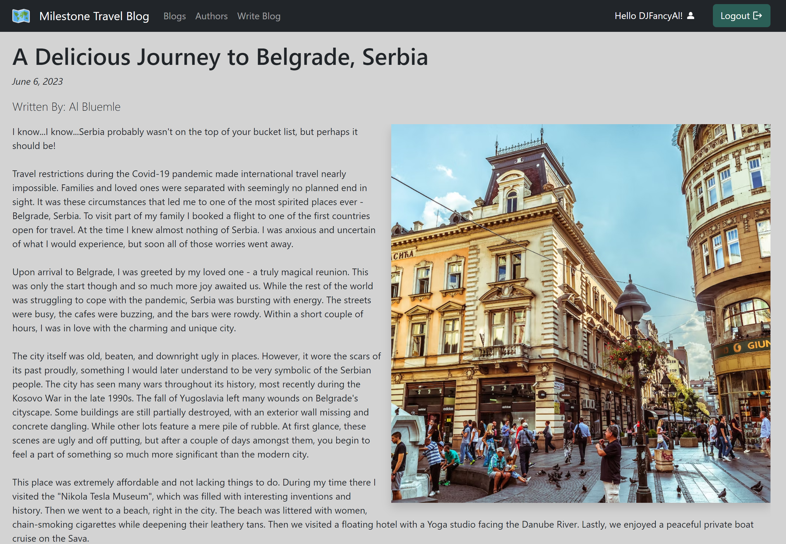

# Travel-Blog

## Description

The Travel Blog was created as an example of a full-stack application where users can view, create, edit, and delete travel blog posts. Additionally, registered users can create and delete comments on existing blog posts. Users are able to register and log in to perform all functions.

### Register

Users may register themself to the Travel Blog by clicking on the "Register" button in the navigation bar. On this page the user will create a username and password for their account. Upon registration the user will be directed to their profile page so they can further edit their detail.

### Login

Registered users can login by clicking the login button in the navigation bar. Here they can use their username and password to login to the site. Here they are able to create and manage their content.

### View Blogs

Users are able to view summaries of existing blog posts by clicking the "Blogs" link in the main menu. Users may click on an inividual blog to read the full post and view the accompanying image.

### Create Blogs

Registered users may create their own blog posts by clicking the "Write Blog" link in the main menu. from this page the user may craft their blog post by adding a title, post body, and the URL of a relevant image.

### Edit & Delete Blogs

Users may edit or delete ONLY blogs they have created. To do this, the user must visit the blog view of one of their posts. They may then select the "Edit Blog" or "Delete Blog" button at the bottom.

### Comments

Users may create and delete comments at the bottom of each blog post. They may only delete comments they have created.

## Demo

A live demo of the Travel Blog is available through Github pages. Here: https://djfancyal.github.io/Travel-Blog/

On this demo - a user may register to create an account, login, and perform all blog functions. Please participate and write your own blog post for other users to see!

## Technologies

This full stack application uses several front-end and back-end technologies. Specifically it uses the MERN Stack ([MongoDB](https://www.mongodb.com/), [Express.js](https://expressjs.com/), [React.js](https://react.dev/), and [Node.js](https://nodejs.org/en)).

### React

The front end of this application uses [React](https://react.dev/) to create a fluid user experience. React-Router-Dom is used to create the appearance of a multi page site, while users are moving between components. React has provided a seamless yet dynamic user experience.

### React Bootstrap

The front end is also styled using [React-Bootstrap](https://react-bootstrap.netlify.app/). This creates a familiar but consistent feel that is friendly to the average user.

### Express

The back end server is built using [Express.js](https://expressjs.com/). Express allowed us to use JavaScript for building our routes and serving data to the front end. Within Express we also used Bcrypt to hash and verify passwords. Additionally we create JSON Web Tokens for authentication.

## Project Description

We are looking to create a Travel blog with the ability for travelers to blog, upload content and leave comments.
Authors will have an opportunity to read the blogs of others and recommend new locations and travel tips.

Create the user interface.
The application will have frontend CSS an Framework.
The Backend will use JavaScript, Bootstrap.
Tables and routes created.

## Project Planning

Front End - React, Bootstrap

Frontend Pages Needed:

-Index
-Posts
-One Post View
-Create Post
-Authors
-Author View

Back End - Express.js
Backend Routes Needed:
Posts Controller
Get - all blog posts
Get - One blog view
POST - Create blog post
UPDATE - Update blog post
DELETE - Delete blog post
Wildcard

Database - MongoDB
Tables Needed:
Blog Posts
Author (String)
Pic(String) (users will submit image link)
Location (String)
Title (String)
Data (Date)
BodyText (String)
Comments
Author (String)
BodyText(String)

Tasks:
Front End
Create React App
Install Material UI
Back End
Npm init
Create express app
Setup server.js
Setup controllers
Setup Models
MongoDB
Create Database
Create tables
